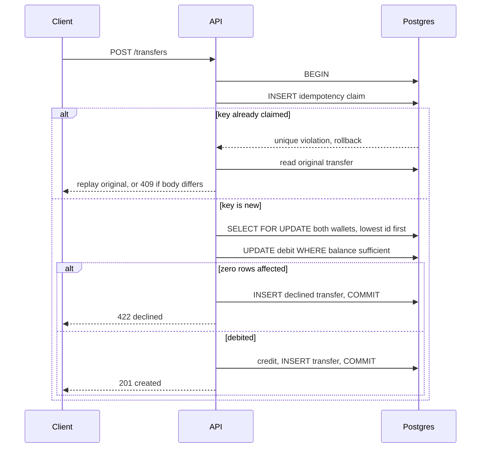

# Wallet & P2P Transfer

A small wallet service with peer-to-peer transfers, built for the Paytm R2 exercise.
Money is integer paise everywhere: no floats, no rupee decimals, in storage, in
aggregation, or on the wire.

- **Live URL:** _pending deploy — see [Deploying](#deploying)_
- **Stack:** Java 21, Spring Boot 4.1.1, PostgreSQL 16, Gradle (Kotlin DSL)
- **Graded properties:** conservation, no overdraft, exactly-once transfer, race-free get-or-create

## Quick start

One command brings up the app and Postgres together:

```bash
docker compose up --build
```

Then reproduce all three probes:

```bash
./burst.sh http://localhost:8080
```

If port 8080 or 5432 is taken on your machine:

```bash
APP_PORT=18080 POSTGRES_PORT=15432 docker compose up --build
./burst.sh http://localhost:18080
```

Run the test suite (needs Docker; it starts a real Postgres via Testcontainers):

```bash
./gradlew test
```

## API

Every endpoint except `/health`, `/info` and `/metrics` requires
`Authorization: Bearer <token>`.

| Method | Path              | Purpose                              | Success |
|--------|-------------------|--------------------------------------|---------|
| POST   | `/wallets`        | Get-or-create the caller's wallet    | 200 |
| GET    | `/wallets/{id}`   | Current balance                      | 200 |
| POST   | `/transfers`      | Move money between two wallets       | 201 |
| GET    | `/transfers/{id}` | Transfer status                      | 200 |
| GET    | `/health`         | Liveness and readiness               | 200 |
| GET    | `/metrics`        | Prometheus exposition                | 200 |

### Auth

The bearer token is a secret the caller picks; there is no registration step.
The user identity is a one-way SHA-256 derivation of the token
(`usr_<24 hex chars>`), so the credential itself never reaches the database,
the logs, or an error response. Two requests with the same token are the same
user. This is deliberately minimal — the exercise does not grade auth
sophistication.

### Opening balance

A new wallet is seeded with 1,000,000 paise (₹10,000), configurable via
`WALLET_OPENING_BALANCE_PAISE`. This exists so a reviewer can transfer
immediately without a funding endpoint. Creating a wallet is not a transfer, so
the conservation invariant — which is asserted across transfers — is unaffected.

### Example

```bash
BASE=http://localhost:8080

A=$(curl -s -XPOST $BASE/wallets -H "Authorization: Bearer alice-secret-token" | jq -r .id)
B=$(curl -s -XPOST $BASE/wallets -H "Authorization: Bearer bob-secret-token"   | jq -r .id)

curl -s -XPOST $BASE/transfers \
  -H "Authorization: Bearer alice-secret-token" \
  -H 'Content-Type: application/json' \
  -d "{\"from\":\"$A\",\"to\":\"$B\",\"amount_paise\":25000,\"idempotency_key\":\"demo-1\"}"
```

Re-sending that exact request returns the identical body with
`Idempotent-Replay: true`. Re-sending it with a different `amount_paise` under
the same key returns `409`.

### Status codes

| Situation | Status |
|---|---|
| Transfer applied | `201` |
| Insufficient funds | `422`, body has `DECLINED_INSUFFICIENT_FUNDS` |
| Same key, same body | Original status and body, `Idempotent-Replay: true` |
| Same key, different body | `409` |
| Debiting a wallet you do not own | `403` |
| Unknown wallet or transfer | `404` |
| Bad JSON, non-positive amount, `from == to` | `400` |
| Missing or malformed bearer token | `401` |

Errors are RFC 9457 problem documents; a stack trace is never returned.

## How correctness is achieved

One database transaction contains, in this order:

1. **The idempotency claim.** `INSERT` into `idempotency_keys`, whose primary
   key is `(user_id, idempotency_key)`. The claim commits with the money or not
   at all.
2. **Row locks on both wallets, taken in ascending wallet id order.** Every
   transfer agrees on this order regardless of direction, which is what stops
   simultaneous A→B and B→A transfers from deadlocking.
3. **A conditional debit** — `UPDATE ... WHERE id = ? AND balance_paise >= ?`,
   treating zero rows affected as declined. No read-modify-write in application
   code.
4. **The matching credit**, so the sum of balances is unchanged.



Full reasoning, including the alternatives that were rejected, is in
[WRITEUP.md](WRITEUP.md).

## Observability

**Logs** are structured JSON (ECS) on stdout, carrying a `correlation_id` on
every line. Supply `X-Correlation-Id` to stitch your own trace; it is echoed
back. Domain events emitted: `wallet_created`, `transfer_created`, `debited`,
`credited`, `declined`, `idempotent_replay`, `idempotency_conflict`.

```bash
docker compose logs -f app | grep '"event"'
```

**Metrics** at `/metrics` in Prometheus format:

| Metric | Meaning |
|---|---|
| `http_server_requests_seconds_*` | Request rate, latency histogram (p50/p95/p99), error rate by status |
| `wallet_transfers_completed_total` | Transfers that moved money |
| `wallet_transfers_declined_total{reason="insufficient_funds"}` | Clean declines |
| `wallet_idempotent_replays_total` | Retries served from the original result |
| `wallet_idempotency_conflicts_total` | Keys reused with a different body |
| `wallet_wallets_opened_total` | Wallets actually created |

Counters are incremented only after the transaction commits, so a rolled-back
attempt never inflates them.

## Container

The [Dockerfile](Dockerfile) is multi-stage (JDK to build, JRE to run), runs as
non-root uid 10001, and defines a `HEALTHCHECK` against `/health`. Verify:

```bash
docker compose exec app id                                   # uid=10001(wallet)
docker inspect --format '{{.State.Health.Status}}' <container> # healthy
```

## Deploying

The repo includes [render.yaml](render.yaml), a Render blueprint that
provisions the web service and a free managed Postgres already wired together.

1. Push this repo to GitHub.
2. In Render: **Blueprints → New Blueprint Instance**, select the repo, apply.
3. Render builds the Dockerfile, provisions Postgres, and injects `DATABASE_URL`.
4. On boot, Flyway creates the schema on the managed database.
5. Hit the assigned `https://<service>.onrender.com/health`.

`DATABASE_URL` arrives as a `postgres://` URL, which JDBC cannot consume;
`DatabaseUrlEnvironmentPostProcessor` translates it at startup. Setting
`SPRING_DATASOURCE_URL` explicitly overrides that.

The free plan sleeps when idle, so the first request after a quiet period can
take 30–60 seconds. `burst.sh` polls `/health` until the service wakes before
it measures anything.

### Configuration

| Variable | Default | Purpose |
|---|---|---|
| `DATABASE_URL` | — | Provider-style Postgres URL, translated to JDBC |
| `SPRING_DATASOURCE_URL` | `jdbc:postgresql://localhost:5432/wallet` | Explicit JDBC URL; wins over `DATABASE_URL` |
| `SPRING_DATASOURCE_USERNAME` / `_PASSWORD` | `wallet` / `wallet` | Credentials |
| `PORT` | `8080` | Listen port |
| `DB_POOL_SIZE` | `10` | Hikari maximum pool size |
| `WALLET_OPENING_BALANCE_PAISE` | `1000000` | Balance a new wallet starts with |

## Layout

```
src/main/java/dev/rdubey/wallet/
  api/              controllers, DTOs, bearer auth and correlation filters, problem+json handler
  application/      WalletService, TransferService, request fingerprinting
  domain/           Money, Wallet, Transfer, IdempotencyRecord, ports, exceptions
  infrastructure/   JDBC adapters, domain event logging, Micrometer counters
  config/           wallet properties, DATABASE_URL translation
src/main/resources/db/migration/  Flyway schema
src/test/java/                    invariant and contract tests
```

The application layer depends on ports declared in `domain`, never on
`JdbcTemplate`, so the money path can be reasoned about and tested independently
of the driver.
